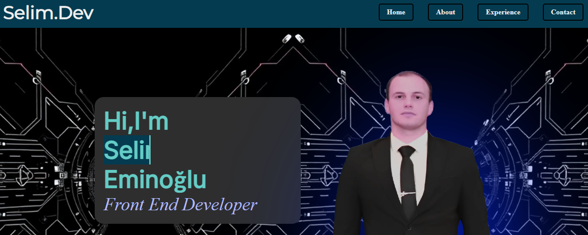
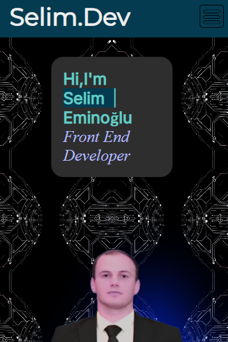
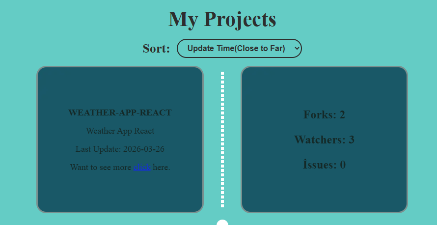

# 🚀 Personal Portfolio Website

Modern, responsive ve kullanıcı odaklı bir kişisel portfolyo sitesi. React ile geliştirilmiş olup, performans ve kullanıcı deneyimi ön planda tutulmuştur.

🔗 **Live Demo:** [https://selim-eminoglu-portfolio.vercel.app/](https://selim-eminoglu-portfolio.vercel.app/)

---

## 📸 Preview

* Ana Sayfa
  
* Mobil Görünüm
  
* Projeler Bölümü
  

---

## 🎯 Purpose

Bu proje, kişisel bilgilerimi, projelerimi ve yeteneklerimi modern bir arayüzle sunmak amacıyla geliştirilmiştir. Aynı zamanda frontend geliştirme becerilerimi sergileyen bir portfolyo projesidir.

---

## ⚙️ Tech Stack

### Frontend

* React
* Vite
* CSS
* Formik & Yup
* React Toastify
* React Scroll
* Intersection Observer

### Backend

* Node.js
* Express
* Nodemailer
* Dotenv
* Cors

---

## ✨ Features

* 📩 İletişim formu (email gönderimi)
* 🎨 Animasyon destekli modern UI
* 📱 Responsive tasarım
* ⚡ Lazy loading (Intersection Observer)
* 🔔 Toast bildirim sistemi
* 🧭 Smooth scroll navigasyon

---

## 📦 Installation

Projeyi lokal ortamda çalıştırmak için:

```bash
npm install
npm run dev
```

---

## 🔐 Environment Variables

`.env` dosyası oluştur ve aşağıdaki bilgileri ekle:

```env
EMAIL_USER=your_email
EMAIL_PASS=your_password
```

---

## 🚀 Deployment

Proje Vercel üzerinde deploy edilmiştir.

---

## 🧩 Updates

### v2.0.0

* Multi-page yapıya geçildi
* UI/UX iyileştirmeleri yapıldı
* Yeni bölümler eklendi (projeler, eğitim vb.)

### v1.0.0

* İlk sürüm yayınlandı
* Temel portfolyo yapısı oluşturuldu

---

## 🧠 What I Learned

* React component yapısı
* Form yönetimi (Formik & Yup)
* API entegrasyonu
* Responsive tasarım
* UI/UX geliştirme

---

## 👨‍💻 Developer

**Selim Eminoğlu**

---

## ⭐ Feedback

Geri bildirimlere açığım. Projeyi beğendiysen ⭐ bırakmayı unutma 🙌
